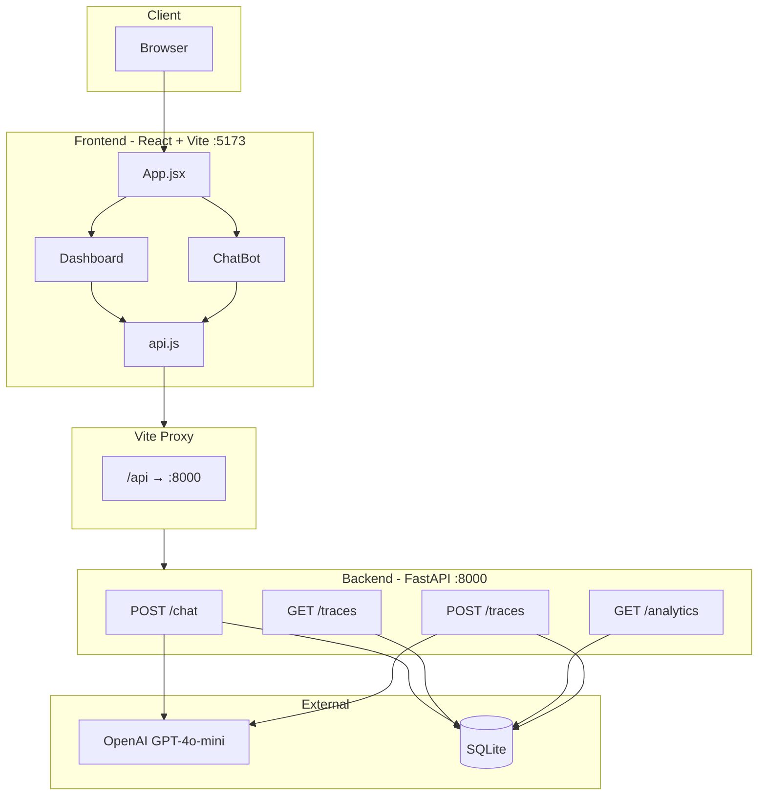
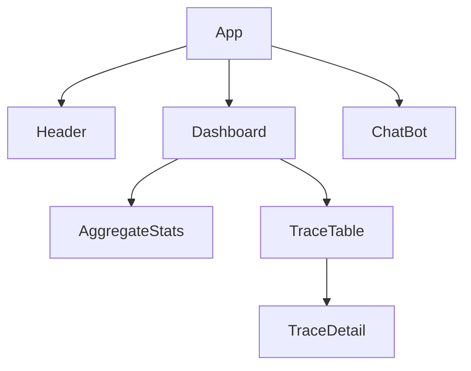
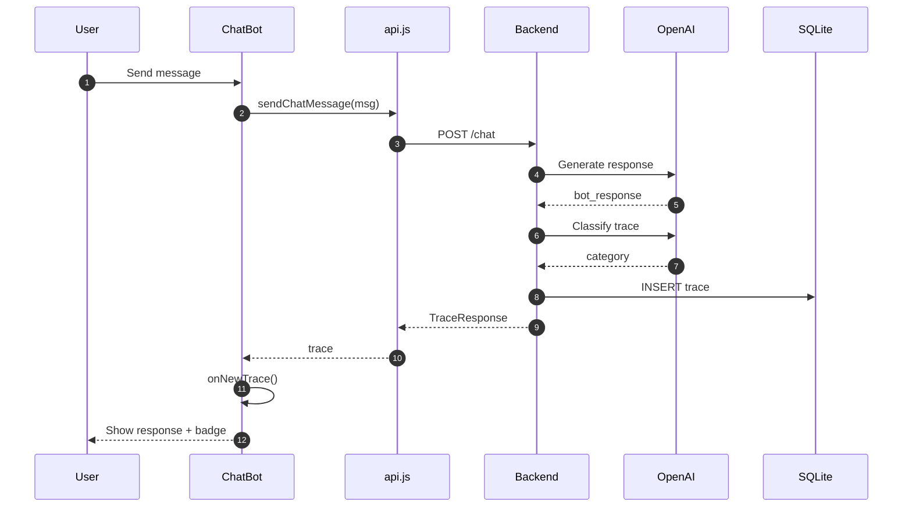
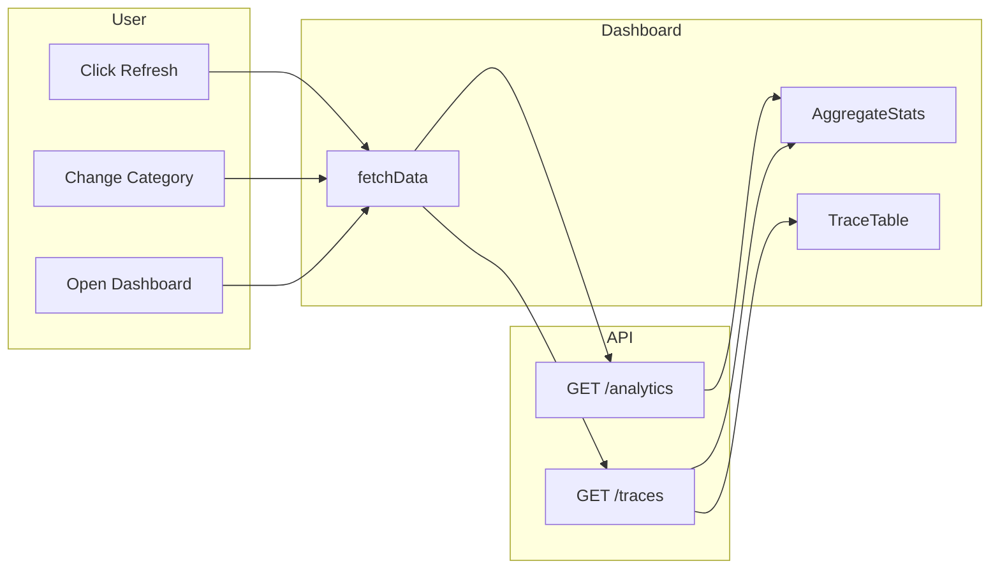
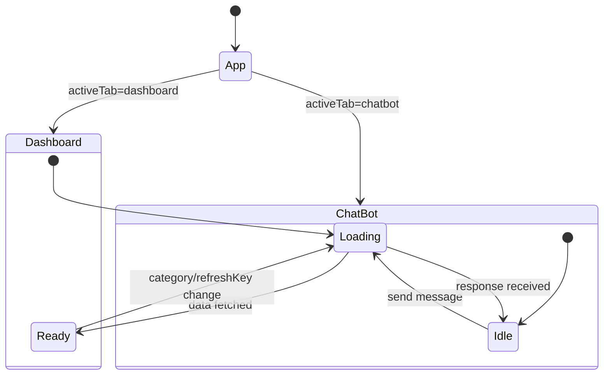
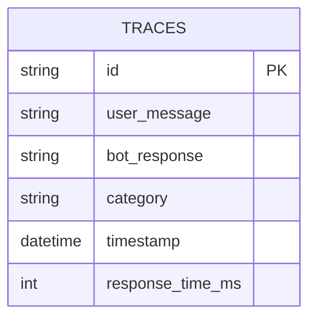
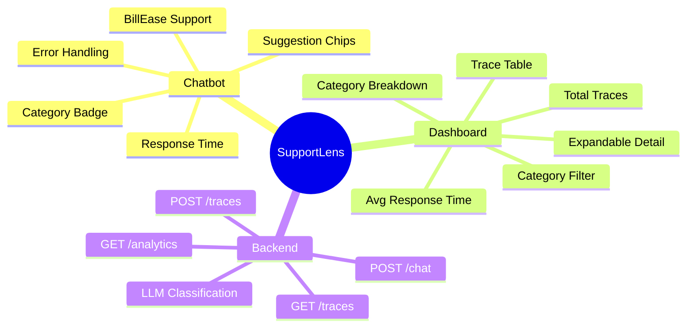

# SupportLens — Flow Diagrams

This document contains Mermaid diagrams for the SupportLens platform. Render in GitHub, VS Code (Mermaid extension), or [mermaid.live](https://mermaid.live).

---

## 1. System Architecture

```
Browser → Frontend (React) → Vite Proxy (/api) → Backend (FastAPI) → SQLite + OpenAI
```



---

## 2. Component Hierarchy



---

## 3. Chat Message Flow (Sequence)



---

## 4. Dashboard Data Flow



---

## 5. Trace Classification Logic

```mermaid
flowchart TD
    A[user_message + bot_response] --> B[Build prompt]
    B --> C[OpenAI: gpt-4o-mini]
    C --> D[raw = response.strip().lower]
    D --> E{Exact match?}
    E -->|Yes| F[Return category]
    E -->|No| G{Partial match?}
    G -->|Yes| F
    G -->|No| H[Return General Inquiry]
```

---

## 6. State Flow (React)



---

## 7. Data Model



---

## 8. Feature Map



---

*Render these diagrams in any Mermaid-compatible viewer for best results.*
