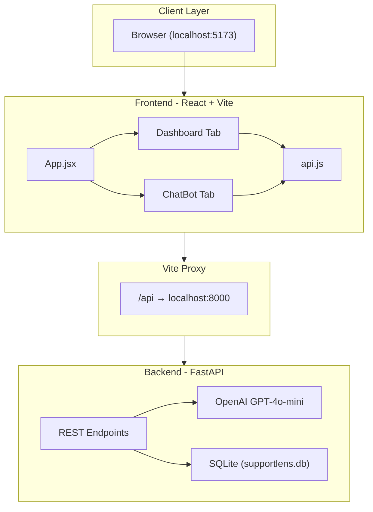
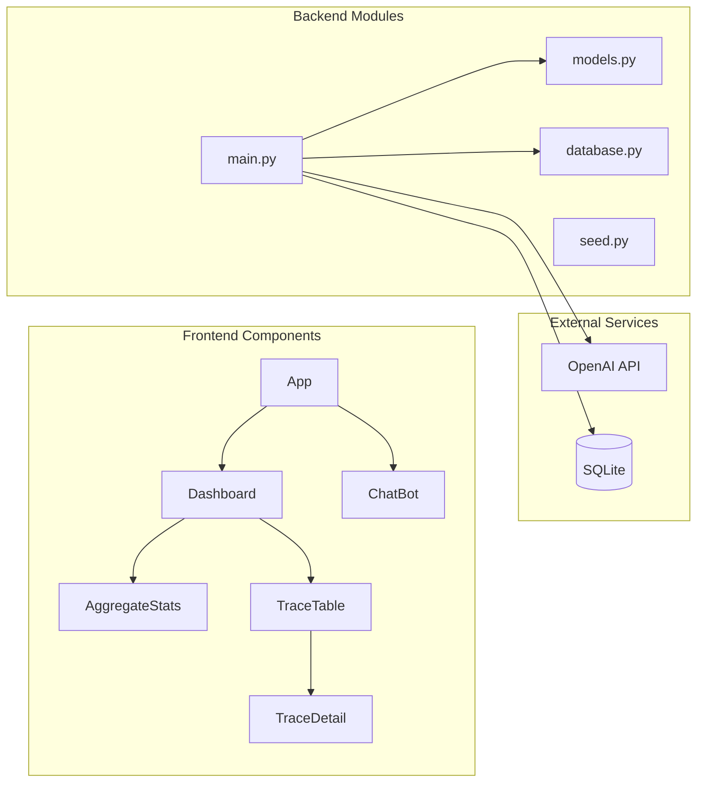
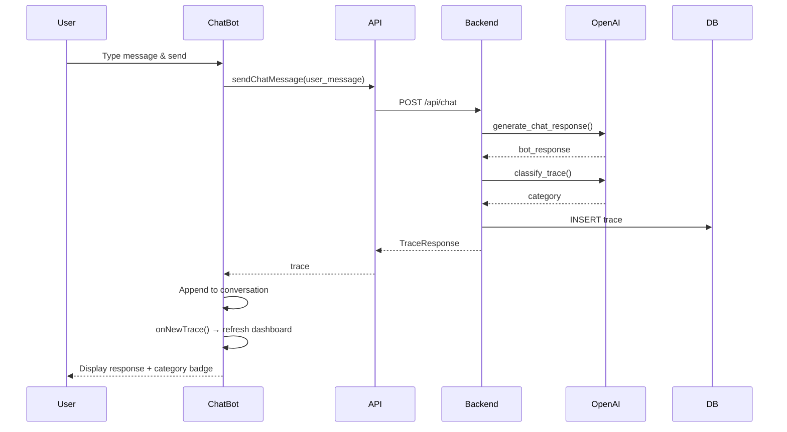
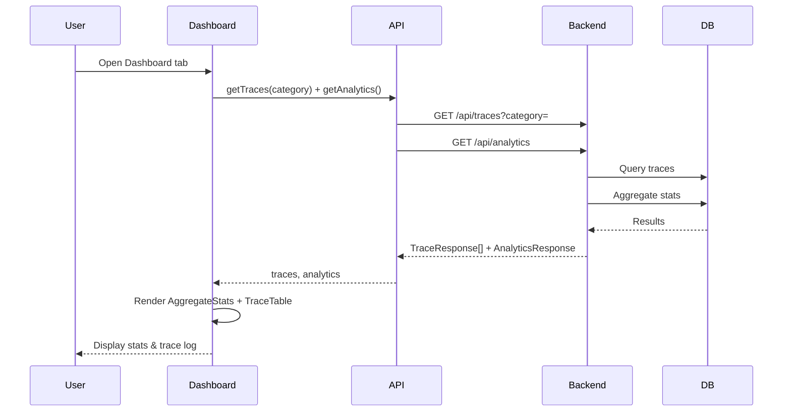
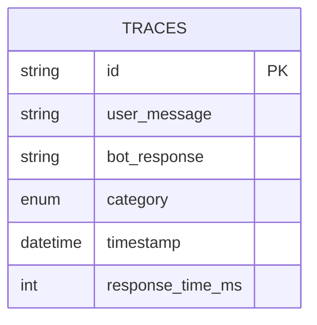
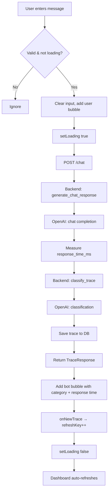
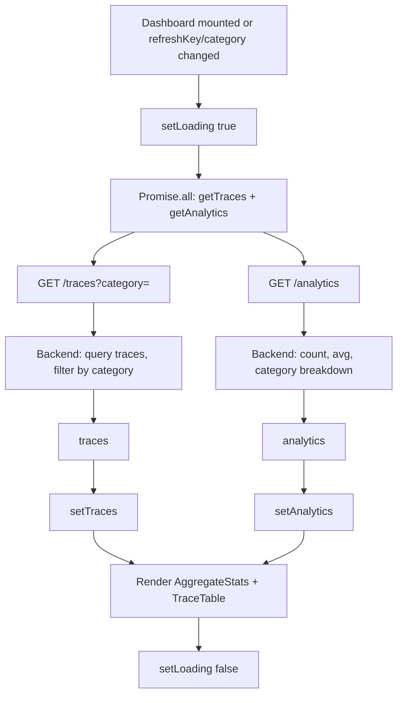
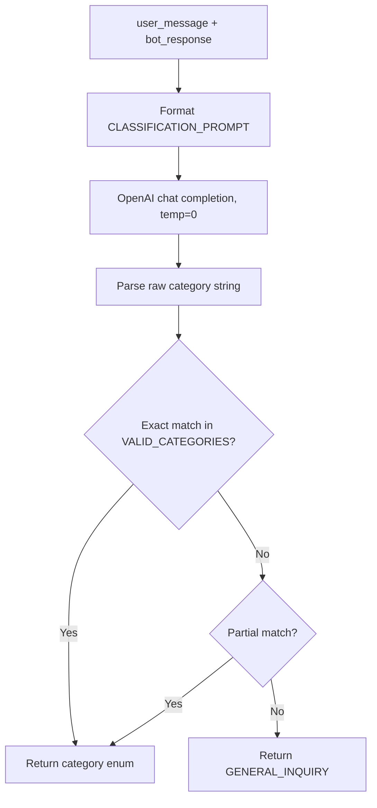

# SupportLens — Technical Documentation

**Version:** 1.0.0  
**Last Updated:** March 4, 2025  
**Project:** Customer Support Chatbot Observability Platform

---

## Table of Contents

1. [Executive Summary](#1-executive-summary)
2. [System Architecture](#2-system-architecture)
3. [Technology Stack](#3-technology-stack)
4. [Backend Documentation](#4-backend-documentation)
5. [Frontend Documentation](#5-frontend-documentation)
6. [Data Models & Schemas](#6-data-models--schemas)
7. [Features Reference](#7-features-reference)
8. [Flow Diagrams](#8-flow-diagrams)
9. [Setup & Deployment](#9-setup--deployment)

---

## 1. Executive Summary

**SupportLens** (internally referred to as *CoreEdgeSolution*) is a customer support chatbot observability platform designed for monitoring and analyzing support conversations. It provides:

- **Live Chat Interface** — BillEase-themed support chatbot powered by GPT-4o-mini
- **Observability Dashboard** — Conversation traces, aggregate statistics, and LLM-based classification
- **Classification Engine** — Automatic categorization of support queries into 5 predefined categories
- **Trace Storage & Analytics** — Full audit trail with response time metrics and category breakdowns

The system is built as a modern full-stack application with React 19 on the frontend and FastAPI on the backend, using SQLite for persistence and OpenAI for chat and classification.

---

## 2. System Architecture

### 2.1 High-Level Architecture



### 2.2 Component Architecture



### 2.3 Request Flow (Chat)



### 2.4 Request Flow (Dashboard)



---

## 3. Technology Stack

| Layer | Technology | Version |
|-------|------------|---------|
| **Frontend** | React | 19.2.0 |
| | React DOM | 19.2.0 |
| | Vite | 7.3.1 |
| | @vitejs/plugin-react | 5.1.1 |
| **Backend** | Python | 3.10+ |
| | FastAPI | 0.115.0 |
| | Uvicorn | 0.30.6 |
| **ORM** | SQLAlchemy | 2.0.35 |
| **Database** | SQLite | (file: supportlens.db) |
| **LLM** | OpenAI API | GPT-4o-mini |
| **Tooling** | ESLint | 9.x |

### 3.1 Dependencies Summary

**Backend (requirements.txt):**
- `fastapi` — REST API framework
- `uvicorn` — ASGI server
- `sqlalchemy` — ORM and database toolkit
- `openai` — OpenAI API client
- `python-dotenv` — Environment variables
- `pydantic` — Data validation

**Frontend (package.json):**
- `react`, `react-dom` — UI framework
- `vite` — Build tool and dev server
- `@vitejs/plugin-react` — React integration for Vite

---

## 4. Backend Documentation

### 4.1 File Structure

```
backend/
├── main.py          # FastAPI app, endpoints, LLM logic, prompts
├── models.py        # SQLAlchemy Trace & CategoryEnum
├── database.py      # SQLite engine, session factory
├── seed.py          # 22 pre-classified seed traces
├── requirements.txt
├── .env.example
└── .env             # (local, not committed)
```

### 4.2 API Endpoints

| Method | Endpoint | Description | Request | Response |
|--------|----------|-------------|---------|----------|
| **POST** | `/chat` | Chat + classify + store trace | `ChatRequest` | `TraceResponse` |
| **POST** | `/traces` | Submit trace for classification & storage | `TraceCreate` | `TraceResponse` |
| **GET** | `/traces` | List traces (newest first), optional filter | `?category=` | `TraceResponse[]` |
| **GET** | `/analytics` | Aggregate statistics | — | `AnalyticsResponse` |

### 4.3 Request/Response Schemas

#### ChatRequest
```json
{
  "user_message": "string"
}
```

#### TraceCreate
```json
{
  "user_message": "string",
  "bot_response": "string",
  "response_time_ms": 0
}
```

#### TraceResponse
```json
{
  "id": "uuid-string",
  "user_message": "string",
  "bot_response": "string",
  "category": "Billing | Refund | Account Access | Cancellation | General Inquiry",
  "timestamp": "2025-03-04T12:00:00Z",
  "response_time_ms": 0
}
```

#### CategoryStat
```json
{
  "category": "string",
  "count": 0,
  "percentage": 0.0
}
```

#### AnalyticsResponse
```json
{
  "total_traces": 0,
  "categories": [ { "category": "string", "count": 0, "percentage": 0.0 } ],
  "average_response_time_ms": 0.0
}
```

### 4.4 LLM Logic

#### Chat Response Generation
- **Model:** GPT-4o-mini
- **System Prompt:** BillEase support agent persona (billing, refunds, account access, cancellation, general inquiry)
- **Temperature:** 0.7
- **Max Tokens:** 300
- **Measured:** Response time in milliseconds

#### Trace Classification
- **Model:** GPT-4o-mini
- **Temperature:** 0
- **Max Tokens:** 20
- **Output:** Exactly one category name
- **Fallback:** Partial string matching; default `General Inquiry` if no match

#### Valid Categories
| Enum Value | Display |
|------------|---------|
| `BILLING` | Billing |
| `REFUND` | Refund |
| `ACCOUNT_ACCESS` | Account Access |
| `CANCELLATION` | Cancellation |
| `GENERAL_INQUIRY` | General Inquiry |

### 4.5 CORS Configuration

- `allow_origins=["*"]`
- `allow_credentials=True`
- `allow_methods=["*"]`
- `allow_headers=["*"]`

### 4.6 Lifespan / Seed Logic

On startup, the application checks if the `traces` table is empty. If so, it seeds 22 pre-classified traces using `seed.py`. Each trace includes:
- User message and bot response
- Category (pre-assigned)
- Response time (ms)
- Timestamps spread over 48 hours

---

## 5. Frontend Documentation

### 5.1 File Structure

```
frontend/
├── src/
│   ├── main.jsx           # Entry point
│   ├── App.jsx            # Root layout, tab routing
│   ├── App.css            # App styles
│   ├── index.css          # Global styles
│   ├── api.js             # API client functions
│   └── components/
│       ├── ChatBot.jsx
│       ├── ChatBot.css
│       ├── Dashboard.jsx
│       ├── Dashboard.css
│       ├── AggregateStats.jsx
│       ├── AggregateStats.css
│       ├── TraceTable.jsx
│       ├── TraceTable.css
│       ├── TraceDetail.jsx
│       └── TraceDetail.css
├── index.html
├── vite.config.js
└── package.json
```

### 5.2 Component Hierarchy

```
App
├── Header (logo, tagline, tab nav)
├── main
│   ├── Dashboard (when activeTab === 'dashboard')
│   │   ├── AggregateStats
│   │   │   ├── Total Traces card
│   │   │   ├── Avg Response Time card
│   │   │   └── Category Breakdown (5 cards + progress bars)
│   │   └── Traces Section
│   │       ├── Category filter dropdown
│   │       ├── Refresh button
│   │       └── TraceTable
│   │           └── TraceDetail (expandable per row)
│   └── ChatBot (when activeTab === 'chatbot')
│       ├── Chat header (avatar, BillEase Support, status)
│       ├── Welcome / suggestions (when empty)
│       ├── Message bubbles (user, bot, error)
│       ├── Typing indicator (when loading)
│       └── Chat input + send button
```

### 5.3 API Client (api.js)

| Function | Endpoint | Description |
|----------|----------|-------------|
| `sendChatMessage(userMessage)` | POST `/api/chat` | Send chat message, returns trace |
| `getTraces(category)` | GET `/api/traces?category=` | Fetch traces, optional filter |
| `getAnalytics()` | GET `/api/analytics` | Fetch aggregate analytics |

**Proxy Configuration (vite.config.js):**
- `/api` → `http://localhost:8000`
- Path rewritten: `/api/chat` → `http://localhost:8000/chat`

### 5.4 State Management

| Component | State | Purpose |
|-----------|-------|---------|
| **App** | `activeTab`, `refreshKey` | Tab selection, dashboard refresh trigger |
| **Dashboard** | `traces`, `analytics`, `selectedCategory`, `loading` | Trace list, stats, filter, loading |
| **ChatBot** | `message`, `conversation`, `loading` | Input, message history, loading |
| **TraceTable** | `expandedId` | Row expansion for detail view |

### 5.5 User Interactions

| Action | Result |
|--------|--------|
| Click tab | Switch between Dashboard / Chatbot |
| Send chat message | POST /chat, append to conversation, trigger dashboard refresh |
| Change category filter | Refetch traces with `?category=` |
| Click Refresh | Refetch traces + analytics |
| Click trace row | Expand/collapse TraceDetail |
| Click suggestion chip | Pre-fill message input |

---

## 6. Data Models & Schemas

### 6.1 Trace (SQLAlchemy Model)

| Column | Type | Constraints |
|--------|------|-------------|
| `id` | String (UUID) | Primary key |
| `user_message` | String | NOT NULL |
| `bot_response` | String | NOT NULL |
| `category` | Enum(CategoryEnum) | NOT NULL |
| `timestamp` | DateTime (UTC) | NOT NULL, default=now |
| `response_time_ms` | Integer | NOT NULL |

### 6.2 CategoryEnum

| Member | Value |
|--------|-------|
| BILLING | "Billing" |
| REFUND | "Refund" |
| ACCOUNT_ACCESS | "Account Access" |
| CANCELLATION | "Cancellation" |
| GENERAL_INQUIRY | "General Inquiry" |

### 6.3 Entity Relationship



---

## 7. Features Reference

### 7.1 Chatbot Features

| Feature | Description |
|---------|-------------|
| Live chat | Send message, receive LLM response in real time |
| BillEase persona | Support agent for billing, refunds, account access, cancellation |
| Suggestion chips | Pre-defined prompts (pricing, refund, login, cancel) |
| Category badge | Each bot message shows LLM-classified category |
| Response time | Displayed per message (ms) |
| Error handling | User-friendly error message on API failure |
| Keyboard shortcut | Enter to send (Shift+Enter for newline, if supported) |

### 7.2 Dashboard Features

| Feature | Description |
|---------|-------------|
| Total traces | Count of all stored traces |
| Avg response time | Mean `response_time_ms` across traces |
| Category breakdown | Count and percentage per category, sorted by count |
| Category filter | Dropdown to filter traces by category |
| Trace table | Columns: Timestamp, User Message, Bot Response, Category, Response Time |
| Expandable rows | Click row to view full TraceDetail (full messages, ID) |
| Refresh | Manual refresh of traces + analytics |
| Auto-refresh | Dashboard refetches when `refreshKey` changes (e.g., after new chat) |

### 7.3 Backend Features

| Feature | Description |
|---------|-------------|
| Chat + trace in one | POST /chat generates response, classifies, stores, returns |
| Trace ingestion | POST /traces for external trace submission |
| LLM classification | GPT-4o-mini categorizes each trace |
| Category validation | 400 on invalid `?category=` |
| Seed data | 22 traces on first run if DB empty |
| CORS | Enabled for dev frontend |

---

## 8. Flow Diagrams

### 8.1 Chat Flow (Detailed)



### 8.2 Dashboard Load Flow



### 8.3 Classification Flow



---

## 9. Setup & Deployment

### 9.1 Prerequisites

- Python 3.10+
- Node.js 18+
- npm
- OpenAI API Key

### 9.2 Backend Setup

```bash
cd backend
python -m venv venv
venv\Scripts\activate   # Windows
pip install -r requirements.txt
copy .env.example .env
# Edit .env: OPENAI_API_KEY=sk-...
python main.py
```

- API: `http://localhost:8000`
- Docs: `http://localhost:8000/docs`

### 9.3 Frontend Setup

```bash
cd frontend
npm install
npm run dev
```

- App: `http://localhost:5173`

### 9.4 Environment Variables

| Variable | Required | Description |
|----------|----------|-------------|
| `OPENAI_API_KEY` | Yes | OpenAI API key for chat and classification |

### 9.5 Build for Production

```bash
# Frontend
cd frontend && npm run build
# Output: dist/

# Backend: run with uvicorn in production mode
uvicorn main:app --host 0.0.0.0 --port 8000
```

**Note:** In production, configure reverse proxy (e.g., nginx) to serve frontend static files and proxy `/api` to the FastAPI backend.

---

## Appendix A: API Error Handling

| Status | Scenario |
|--------|----------|
| 400 | Invalid `category` query parameter |
| 500 | OpenAI API failure, DB error |

Frontend treats non-OK responses as generic "Failed to..." errors.

---

## Appendix B: Seed Trace Distribution

| Category | Count |
|----------|-------|
| Billing | 5 |
| Refund | 4 |
| Account Access | 4 |
| Cancellation | 4 |
| General Inquiry | 5 |
| **Total** | **22** |

---

*End of Technical Documentation*
